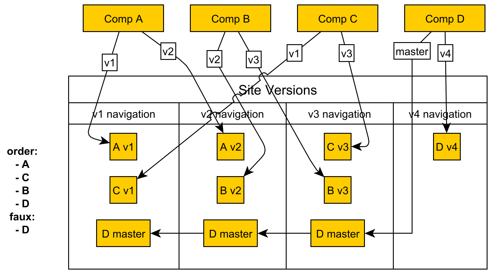

= Extension

In the image below a site has four components, two versions each.

.Example extension configuration
[source,yaml]
----
latest_version: master
order:
- A
- C
- B
- D
faux:
- D
----

This configuration means: I want to combine navigations of component `A`,
`C`, `B` and `D` in this order in every version. More, I want navigation of
`master` branch of each `faux` key components (there can be more than one)
to be added to every version available.

If `faux` component has another version but `master`, it will be preserved.

.How site versions are built

== Configuration Example

----
antora:
  extensions:
  - require: './extensions/navigation-combiner.js'
    latest_version: master
    order: &COMPONENTSORDER
    - ComponentA
    - ComponentC
    - ComponentB
    - title: More Components
      order:
      - ComponentX
      - ComponentY
      - ComponentZ
    - ComponentD
    faux:
    - ComponentD
    - ComponentE <.>
asciidoc:
  attributes:
    page-componentsorder: *COMPONENTSORDER <.>
----
<.> `ComponentE` will be added to the very end of every site version
    navigation tree, because it is not listed under `order` key
<.> This is needed because we do not know where each site version should go,
    what page would be first on version change. So we use this information
    to take first one available according to the config.
